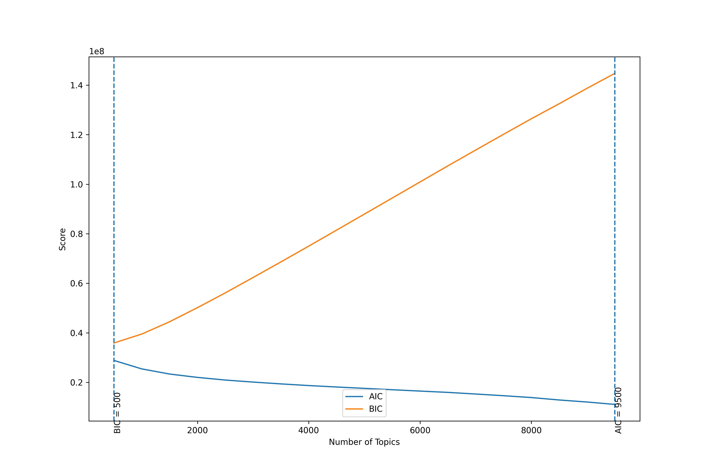

# Exploration of GMMs for overlapping topics

This folder includes a script to grid search different parameters for GMMs (mainly number of components) and PCA (adjusting the number of dimensions). The latter was included to reduce the dimensionality of the entity embeddings and facilitate entities being shared across topics. As objective functions, we use either AIC or BIC scores.

Unfortunately, the scores diverged across PCA and GMM configurations, BIC always recommending as small a model as possible, while AIC recommending the largest model considered. Further evaluation of the overlapping (even in low-resolution PCA configurations) taxonomy revealed only a minor number of entities appear in more than a topic, suggesting there is little need to accomodate for them.

**Resolution**: Ignore overlapping taxonomies.
