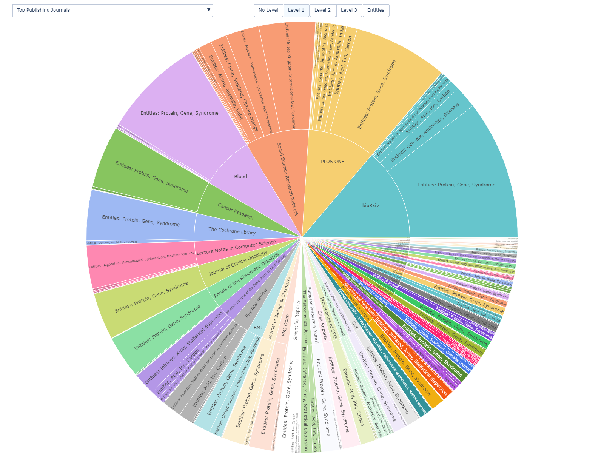
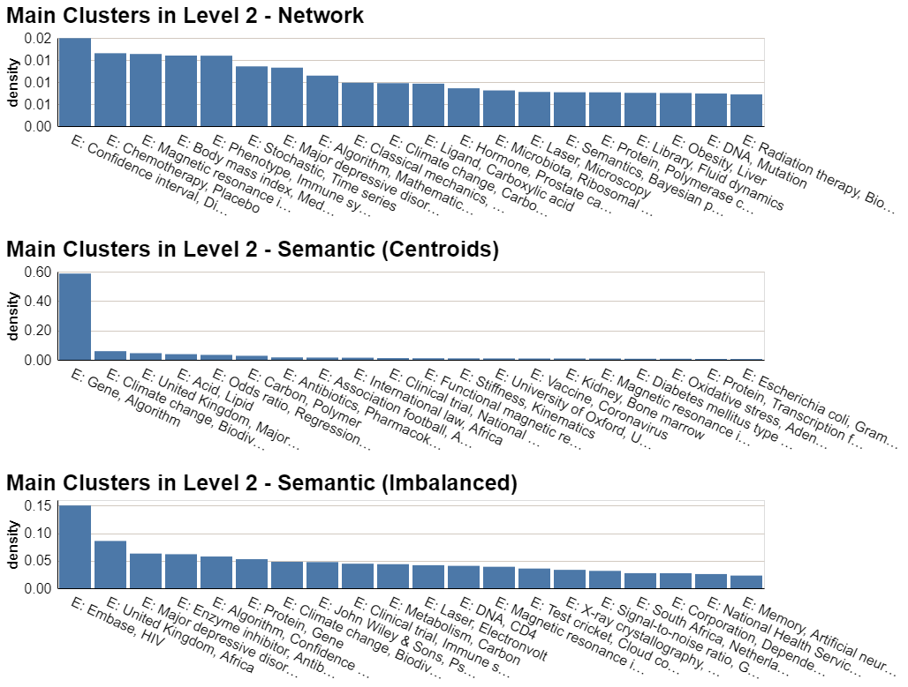
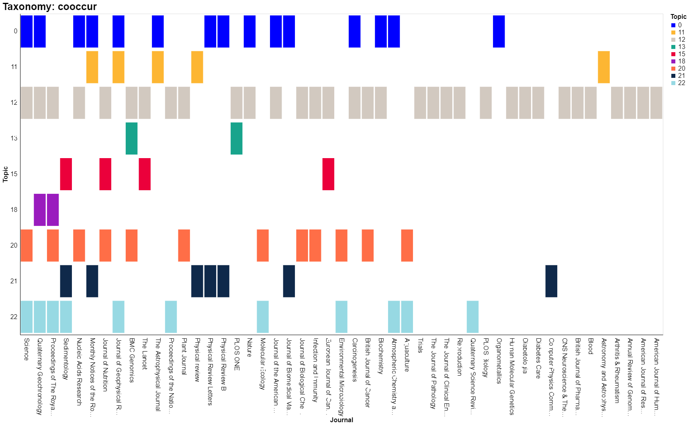
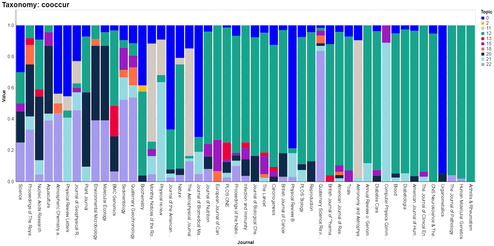
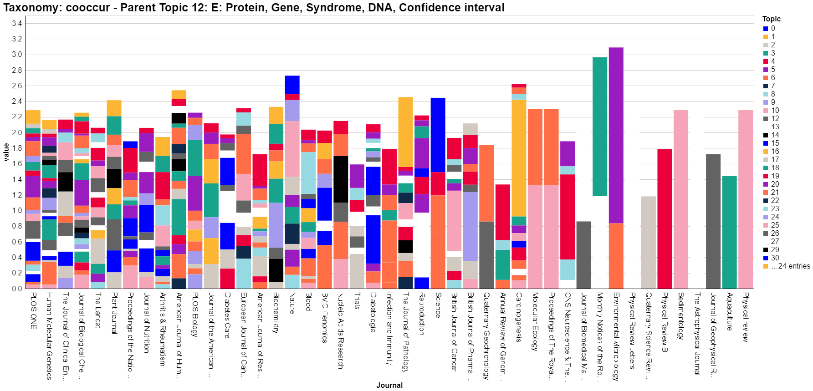

# Taxonomy Validation

## Overview

This folder builds labelling schemes for the different topics within the explored taxonomies, namely network and semantic-based approaches. It also creates two sets of plots to visualise and compare taxonomies.

## Topic labelling

Two sets of labellings are possible:

- **entity labelling:** uses absolute counts of DBpedia tags across OpenAlex articles to label topics with the most frequent entities.
- **journal labelling**: labels topics of the hierarchical taxonomy by using a topic's most prominent associated academic journals, measured as how frequent entities in a topic are also entities in a journal. The ranking of relevant journals should account for the relevance of an entity within the topic, the relevance of an entity within the journal, as well as the relevance of a journal vis-à-vis other journals. To that end, we estimate the marginal contribution of journal $j$ to topic $c$ via the entity $i$ as:

  $$
  contrib_{(c,i,j)} = \log\left(2 + \text{freq}_{(c,i)}\right)^2\cdot\log\left(1 + \text{freq}_{(c,j)}\right)^2 \cdot \text{freq}_{(j,i)}
  $$

  where$\;\text{freq}_{(c,i)}$ is the frequency of entity $i$ relative to other entities in sub-topic $c$, $\;\text{freq}_{(c,j)}$ is the frequency of journal $j$ in sub-topic $c$ over other journals also present in $c$, and $\text{freq}_{(j,i)}$ is the frequency of entity $i$ in journal $j$ relative to other entities in $j$. For each subtopic $c$, scores for all journal contributions are then estimated, ie.

$$
scores_{(c,j)} = \sum_{i=1}^{I}contrib_{(c, i, j)} \quad \forall \;j \in \{1, 2, ..., J\}
$$

    and the top$\;n$ scores are used to build the labelling.

To produce these labels as dictionaries, execute the following command.

`python dap_aria_mapping/pipeline/taxonomy_validation/make_topic_name_assignment.py --taxonomy cooccur --label_type entity --levels 1 2 --n_top 3 --n_articles 1000`

## Visualisation

The subfolder `sunbursts` includes code for plotting three different sunburst plots, namely:

- `make_sunburst_clusters` outputs sunbursts with one or more levels of the hierarchical taxonomy as the inner rings, and the associated entities as the outter layer. To create this plot, execute the following command:
  `python dap_aria_mapping/pipeline/taxonomy_validation/sunbursts/make_sunburst_clusters.py --n_entities 250 500 --levels 1 2 --n_articles 1000`
- `make_sunburst_entities` creates a sunburst plot with entities as the center object and the counts of journals where these appear as the outter plot layer. To create this plot, execute the following command:
  `python dap_aria_mapping/pipeline/taxonomy_validation/sunbursts/make_sunburst_entities.py --n_entities 250 500 --n_articles 1000`
- `make_sunburst_journals` creates a sunburst plot with journals as the center layer, levels of the hierarchical cluster as intermediate layers, and entity counts associated to topics and journals to the otter layers. To create this plot, execute the following command:
  `python dap_aria_mapping/pipeline/taxonomy_validation/sunbursts/make_sunburst_journals.py --n_journals 20 --levels 1 2 3 --n_articles 1000`

The subfolder `histograms` contains file `make_histogram_levels.py`, which produces histograms across taxonomies for a given level of the hierarchy. To run this code, execute the following command:

`python dap_aria_mapping/pipeline/taxonomy_validation/histograms/make_histogram_levels.py --taxonomy cooccur centroids imbalanced --level 2 --n_top 20 --n_articles 1000`

It also contains a series of interactive histograms that display three distinct sets of journal-to-topic variables:

- The **count** of relevant topics for each journal. Relevant topics are defined as those topic assignments that are most prevalent within a journal and whose cumulative share is below 80% of the total number of topic assignments. Note that journals are ordered from most topic diversity to least topic diversity. To build this histogram, execute the following command line:

  `python dap_aria_mapping/pipeline/taxonomy_validation/histograms/make_journal_topic_histograms.py --taxonomy cooccur --histogram unary --level 1 2 --parent_topic None 12 --sample main --threshold 0.8 --n_articles 1000 --save`

- The **relative share** of all topic assignments within journals. This produces stacked barplots normalised to between 0 and 1, and journals are ordered by the relative size of their main topic. To obtain this histogram, run:

  `python dap_aria_mapping/pipeline/taxonomy_validation/histograms/make_journal_topic_histograms.py --taxonomy cooccur --histogram frequency --level 1 2 --parent_topic None 12 --sample main --threshold 0.8 --n_articles 1000 --save`

- The **TF-IDF weights** of all topic assignments within journals. This produces a stacked histogram where values are the TF-IDF weights of the journal (D) to topic (N) matrix, and where journals are ordered by the relative size of their largest topic TF-IDF weight. To build this histogram, run:

  `python dap_aria_mapping/pipeline/taxonomy_validation/histograms/make_journal_topic_histograms.py --taxonomy cooccur --histogram tfidf --level 1 2 --parent_topic None 12 --sample main --threshold 0.8 --n_articles 1000 --save`

Note that all three sets of histograms can be exported in a single command execution, as well as different combinations of levels, associated parent topics (when level is more than 1), random samples of journals, random thresholds for the unary plots, and different choices of a taxonomy class. In order to output all possible histogram combinations, execute the following line:

`python dap_aria_mapping/pipeline/taxonomy_validation/histograms/make_journal_topic_histograms.py --taxonomy cooccur imbalanced centroids --histogram unary frequency tfidf --level 1 2 3 4 5 --parent_topic None all all all all --sample main --threshold 0.8 --n_articles 5000 --save`

## Work in development

### **Identify outlier journals & entity groups**

Rationale - Some journals may be introducing biases by publishing “outlier” articles, which may cause our clustering approaches to identify topics in the taxonomy that are of little relevance and driven by fringe publishers. Similarly, consider entity groups (ie. countries) that we may want to exclude.

Planned approach - create scatter plots of the diversity and uniqueness of entities against the number of publications we have for each journal. Evaluate and exclude outliers.

### **Compare taxonomy against randomised classification**

Rationale - A good benchmark for any taxonomy approach we adopt is to compare it to the hierarchical clustering that would occur from randomly assigning entities to topics.

High-level method description - Simulate many scenarios of randomised taxonomies, test how often we produce more concentrated and well-identified topics.

### Estimate semantic purity of sub-topics

Rationale - Exploit the semantic embeddings of the entities in the taxonomy to estimate measures of purity, ie. the variance in embeddings within a sub-topic upon assuming a distribution. The further down in the taxonomy, the more we would expect the variance of embeddings (noise) to reduce. Use this to guide a stopping criteria for semantic-based taxonomy approaches.

High-level method description - Define measures of sub-topic dispersion using the semantic embeddings. Estimate increases in purity the lower the sub-topic is in the taxonomy. Compare with randomised taxonomy, and use as stopping criteria when employing semantic approaches
